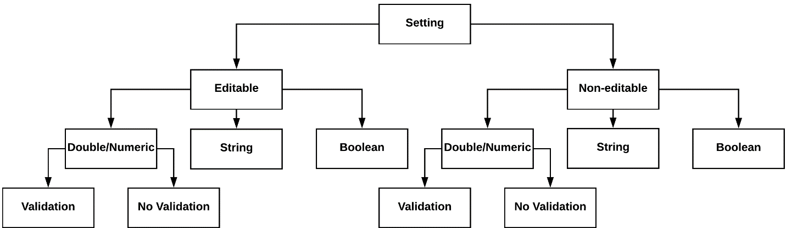
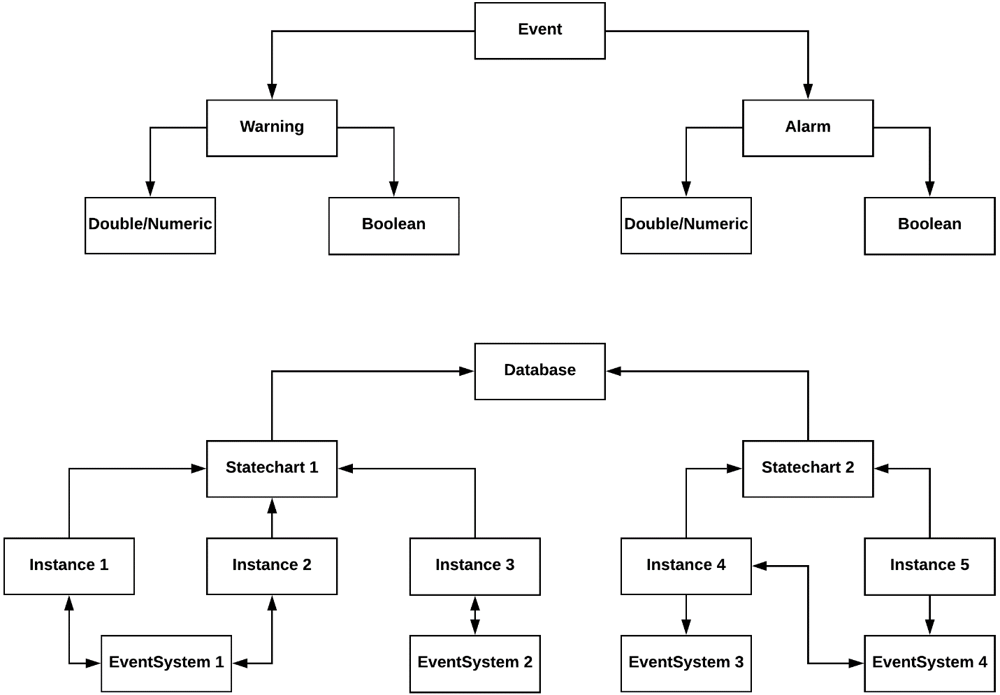
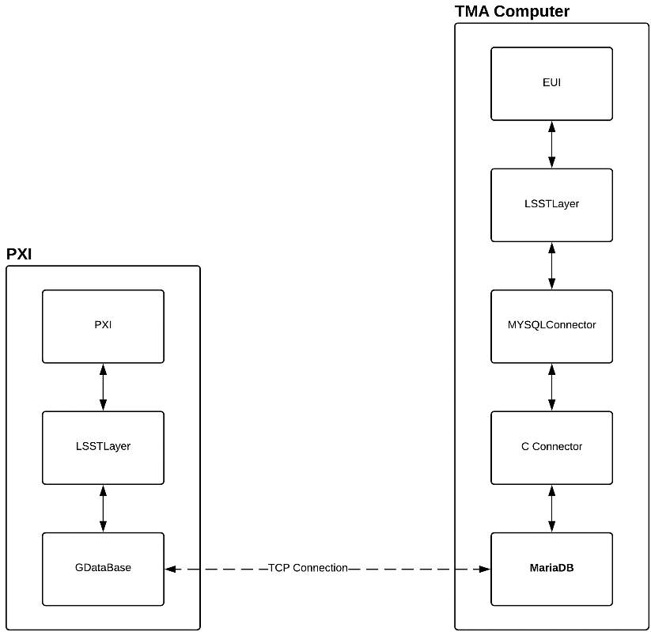
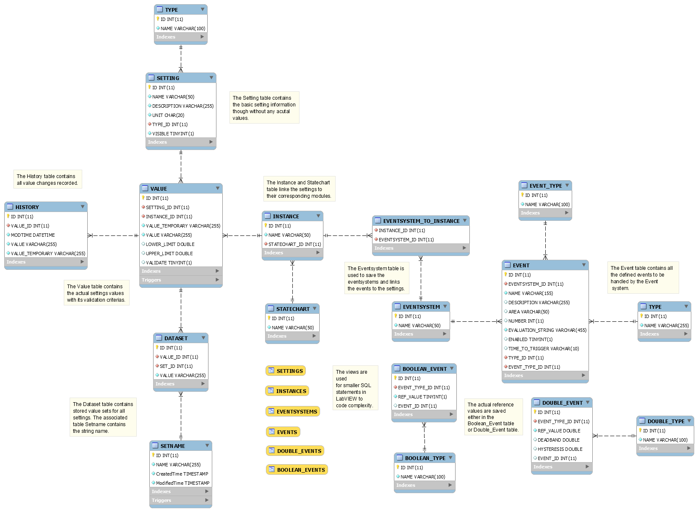
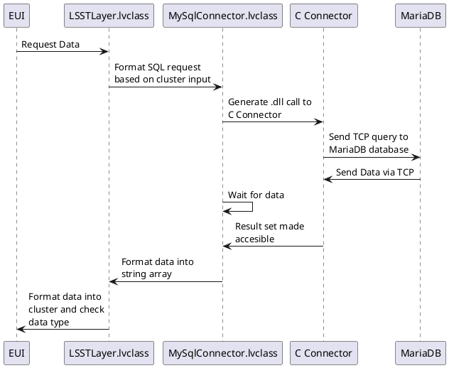
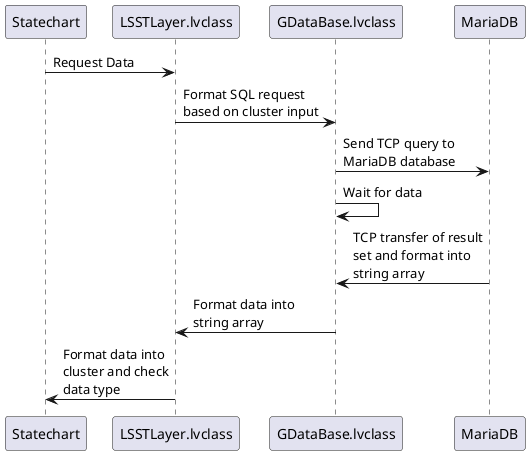

# Settings & Event Storage Documentation

The Setting and Event Storage system both rely on a database and therefore use similar architecture and concept. Hence,
they are both treated in the same documentation chapter.

## Settings

The setting system is at the core of the TMA software. It is responsible for providing all other submodules with the
settings (manageable and non- manageable), which allow them to function correctly. Hence, it was designed with the
utmost focus on reliability and performance.

At its core, it is used to store user manageable settings (e.g. Tracking Speed) and non-user manageable settings (e.g.
Maximum Permissible Operating Temperature). The non-user manageable ("invisible") settings are not shown in the Setting
interface of the EUI to regular users, and only high level users can access them.

The Setting system supports three different types of settings: a) string settings, b) Boolean settings and c) double
settings (i.e. numeric settings). Only numeric/double settings can be validated against a non-user editable lower and
upper limit. This avoids operators to accidentally damage the system by choosing dangerous setting values outside the
permissible limits.

Each setting is constructed by combining the properties, which make up a setting record.

Each setting is associated to one instance and each instance is associated to one statechart (and each event system can
be associated to any number of instances belonging to the same statechart). Each statechart has a "general" instance,
which stores settings, which need to be accessed from all instances of the statechart. A setting stored in a specific
(non-general) instance, can only be accessed by this instance (i.e. by providing statechart and instance name). This
"sandboxed" approach, avoids submodules accessing incorrect settings, with potential harmful values for their submodule
due to naming conflicts. All settings are stored in a database called lsst_settings.

This diagram visualizes the relationships between the individual records within the database. An arrow
indicates a \"belongs to\" relationship.

Each change of a setting needs to be recorded so the operator can retrieve the state of the overall system at any given
point during its operational life time. To allow the operator quickly adjust to different operating environments, the
system supports saving a particular set of settings (i.e. a collection of settings with specified values). A set is
associated with a name (e.g. windy settings) and can be applied with one single operation. This allows the user to
prepare several different setting sets for different operating scenarios.

## Event Management

The Event Management system is designed to store events in a database to allow easier configuration and avoid storing
constants in the individual VIs of the submodules. Each Event is defined by its name, area code, level (i.e. warning or
alarm) and type (i.e. Boolean or double/numeric). Additionally, each Event is associated with one event system and each
event system is associated with one or more instance from one statechart. With the use of the universal library
EventManagement, event initialization, evaluation and cleaning can be done automatically on an event system basis.
Additionally, the evaluation step includes a parser developed by **TEKNIKER**, which allows the evaluation of complex
event conditions using MATLAB syntax. The development of the evaluation statements is supported via an intelligent
autocomplete feature in the event development editor.

Each event is constructed by combining the properties, which make up an event record.

The association of each event system with one or several specified instances allows the system to quickly retrieve the
current applied temporary setting values of those instances and use them to evaluate the complex evaluation
statements. This allows events to change in behavior based on the operator modifying settings or applying sets to the
system. Like with the setting system, the event management system applies a similar "sandboxed" approach and only
attempts to evaluate events associated with the currently used event system.

## Database

The Database is used for saving setting and event records. It consists of a total of two databases, one responsible for
settings and the associated data and one for events.

### Introduction

MariaDB was chosen as the preferred Database choice on CentOS (the EUI computer). MariaDB is a fork of MySQL and closely
matches the functionality of such, however offers a truly open source solution. The chosen general-purpose storage
engine is InnoDB (the default choice), which is a balance between performance and reliability. The database has been
configured to create a mysqldump (i.e. backup) once each day at 12:05 PM at `~/LSST/mariadb-docker/backup/`. Additionally,
there is another backup saved in [github lsst-ts](https://github.com/lsst-ts/ts_llconfig_mtcs), these two backups are done
by a crontab task that calls the `~/LSST/mariadb-docker/createbackup.pl` perl script.
The database can be accessed locally and remotely from the TMA-PXI and AUX-PXI.

### Structure

The database structure has been designed to closely mirror the LSST TMA software design in its modular nature. Each
statechart (i.e. separate subsystem of the TMA software) is associated with many instances, while each instance is
restricted to one statechart. Each instance has many event systems and each event system has many instances. This
allows the "sandboxing" of settings to specific instances (e.g. the maximum acceleration of a drive in the CCW should
not be the same as the on the ACW despite them sharing the same code).

Visualization of the database access by the different components in the EUI and PXI.

The setting system differentiates between two values: a temporary value (referred as "written") and a saved value. This
distinction has an obvious logical flaw: both values are saved.

Having this differentiation allows the experimentation with new settings, with the ability to quickly roll
them back. If however, the operator has already saved the new setting, but still requires the retrieval of the previous
setting value, a history table is used. The history table acts as a log of all value changes to any of the settings. It
enables the operator to view the system settings at any given point in the past (via the EUI) and restore setting values
at a specified point in the past (see EUI documentation). A new entry is created each time the temporary or saved value
of a setting is modified.

This is the relationship overview between the different tables in the lsst_settings and lsst_events databases.

#### Connecting from the EUI

Connections from the Engineering User Interface (EUI) are handled by the universal class LSSTLayer. In the absence of a
native Linux LabVIEW MySQL interface, this solution relies on the use of the internally developed class MYSQLConnector,
which is based upon the C API MySQL Connector.

The workflow for requesting data from the EUI is using the setting name to query data using the LSSTLayer class Get
method. The method translates the request into a SQL statement with respect to the database structure. Then, the
MYSQLConnector class opens a connection to MariaDB via the C connector dll and sends the SQL statement via TCP
connection. The MYSQLConnector class waits until the C connector has received the answer from MariaDB. At this point,
the MYSQLConnector reads it from memory and translates it into a human readable string. The LSSTLayer class then checks,
whether the string contains data, which corresponds to the expected type of data (numeric, Boolean or string) and then
converts the string accordingly. At the end of the process, the MySQL connection is terminated to avoid keeping open a
MySQL connection, which may not be used for a while.

This sequence diagram shows a data request from the EUI to the MariaDB database.

#### Connecting from the PXI

Connections from the PXI are handled by the universal class LSSTLayer. In the absence of a native PXI LabVIEW MySQL
interface, this solution relies on the use of the externally developed class GDataBase by Saphir, which implements its
own TPC connection to the database.

The workflow for requesting data from the PXI is using the setting name to query data using the LSSTLayer class Get
method. The method translates the request into a SQL statement with respect to the database structure. Then, the
GDataBase class opens a connection to MariaDB and sends the SQL statement. The GDataBase class waits until it has
received the answer from MariaDB. At this point, the GDataBase translates it into a human readable string. The LSSTLayer
class then checks, whether the string contains data, which corresponds to the expected type of data (numeric, Boolean or
string) and then converts the string accordingly. At the end of the process, the MySQL connection is terminated to avoid
keeping open a MySQL connection, which may not be used for a while.

This sequence diagram shows a data request from the PXI to the MariaDB database.

TODO: update after change request
